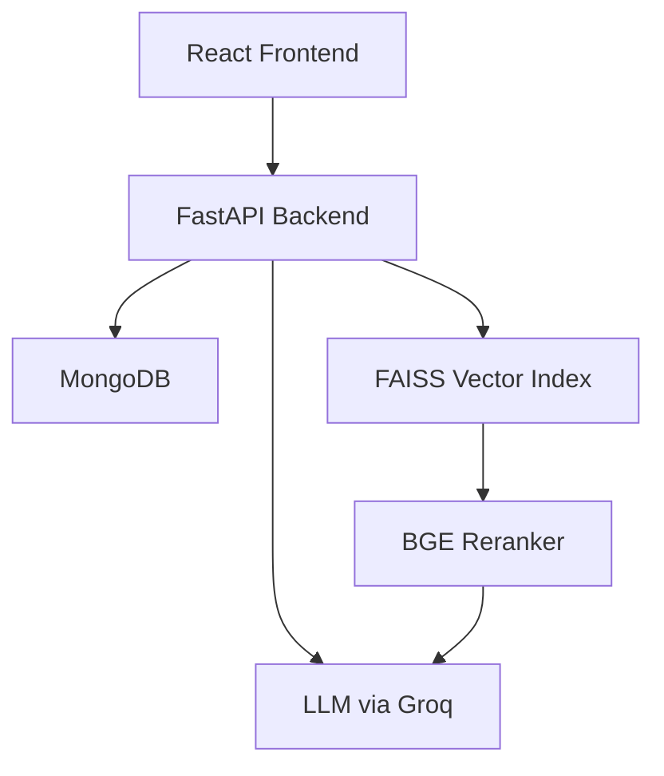

## Meeting Intelligence Hub
> An AI-powered meeting intelligence platform that converts raw transcripts into decisions, tasks, and searchable insights using a custom RAG pipeline.

## 🎥 Demo Video
[](https://drive.google.com/file/d/1HaxOBSXsASlW4IjiKtKmesqKk9N0GNvs/view?usp=drivesdk)
---

## 1. Project Overview
**Problem:** Meetings are unstructured, time-consuming, and difficult to track. Important decisions often get buried in lengthy transcripts, and action items are frequently lost or forgotten.

**Solution:** The Meeting Intelligence Hub converts these raw conversations into structured, actionable intelligence. It provides visibility into what was decided, who is responsible for next steps, and allows users to query their meeting history with high factual accuracy.

**Key Capabilities:**
- **Automated Intelligence:** Extracts structured decisions and action items (Who, What, By When) using Llama 3.3-70B.
- **Conversational Search:** A custom RAG-based chatbot with semantic search for meeting-wide and cross-meeting queries with citations.
- **Emotional Analytics:** Segment-level emotion tracking and per-speaker sentiment breakdowns.
- **Execution Layer:** A live action tracker to manage and complete extracted tasks.
- **Explainability Layer:** Full traceability linking every decision back to the exact transcript segments with interactive, collapsible source cards.
- **Exporting:** Integrated CSV and PDF export for decisions and action items.

---

### 🌐 Global & Multi-Meeting Intelligence
The RAG engine is equipped with **Diversity-Aware Retrieval** to ensure that workspace-wide queries (e.g., "trends across all meetings") provide a balanced perspective.
- **Intent Detection**: Automatically distinguishes between "Focused" (single-meeting) and "Global" (cross-meeting) queries.
- **Deep Discovery**: Global queries utilize a enlarged **100-segment candidate pool** to ensure evidence from smaller meetings is not crowded out by larger ones.
- **Diversity Sampling**: Instead of retrieval being dominated by a single similar meeting, the system groups candidates and ensures representative evidence from every relevant meeting is included in the AI's context.
- **Adaptive Context Window**: Dynamically scales from 10 segments (Focused) to **15 diverse segments** (Global) for comprehensive cross-meeting synthesis.


## 2. Tech Stack
- **Backend:** FastAPI (Python)
- **Frontend:** Next.js (App Router, Tailwind/Vanilla CSS) with TanStack Query for state management
- **Database:** MongoDB (Persistent storage for metadata and segments)
- **Vector Store:** FAISS (Local in-memory indexing for semantic search)
- **Embeddings:** `all-MiniLM-L6-v2` (384-dimension sentence embeddings)
- **Reranker:** `BAAI/bge-reranker-base` (Cross-Encoder for high-precision retrieval)
- **LLM:** Llama 3.3-70B via Groq (For extraction and RAG generation)
- **Emotion Model:** `distilbert-base-uncased` fine-tuned on Saravia Emotion Dataset

---

## 3. Features 
### Decision and Action Item Extractor
Uses Llama 3.3-70B with highly structured prompting to parse raw transcripts. It identifies:
- **Decisions:** Key agreements and strategic shifts.
- **Action Items:** Structured tasks including **Responsible Person**, **Task Description**, and **Deadline/Date**.
This moves the system from "simple text storage" to "structured intelligence." Results are presented in a clean, readable table with an integrated export option.

### Meeting Management & Grouping
A comprehensive and interactive archive of all processed transcripts. 
- **Flexible Grouping:** Dynamically group your meetings chronologically (by date) or thematically (by project/meeting name) via seamless client-side filtering.
- **Single Meeting Deletion:** Clean up your workspace by permanently deleting individual meetings with a single click.
- **Clear All Workspaces:** Reset your environment with a safe, confirmed "Clear All" action.
- **Real-time UI Synchronization:** Fully integrated with TanStack Query and backend mutations, ensuring instant, layout-shift-free updates across the dashboard.

### Action Item Tracking
An execution layer that converts extracted action items into a managed state. Users can mark tasks as completion, providing a closed-loop system for meeting outcomes.

### Operational Efficiency: Accurate Task Tracking
The system maintains real-time task state synchronization by distinguishing between pending and completed action items. Aggregated metrics are derived dynamically to reflect actionable workload across meetings.

### Visualization Stability
The visualization layer is optimized for cross-device compatibility by reducing shader complexity and ensuring fallback-safe rendering.

### RAG Chatbot
A Retrieval-Augmented Generation pipeline using FAISS over semantic segments. It includes source attribution, allowing users to see exactly which parts of the meeting the AI is referencing.
- **Scoped Chat:** Narrowly focused on a single meeting for high precision.
- **Global Chat:** Cross-meeting intelligence for broad workspace queries.

### Emotion & Speaker Analysis
Identifies distinct speakers and analyzes the "emotional temperature" of every segment. This helps identify where agreement occurred or where conflict arose during a discussion.

### Explainable AI & Source Traceability
Every AI response generated by the RAG pipeline is backed by interactive, traceable evidence. 
- **Human-Readable Citations:** AI answers include source attribution grouped by **Meeting Title** (or Meeting ID fallbacks) for immediate clarity.
- **"Show Evidence" Interaction:** To keep conversations focused, high-precision source cards are hidden by default and accessible via a single click.
- **Direct Transcript Navigation:** Clicking a source card takes the user directly to the exact moment in the meeting transcript.
- **Context-Aware Highlighting:** The system preserves conversational context by highlighting the target segment along with surrounding dialogue (±2 segments).
- **Visual Evidence Pulse:** A temporary visual "pulse" guides the user's eye to the specific evidence referenced by the AI.
- **Emotion-Aware Citations:** Sources include detected emotions and speaker roles, providing deeper subtext for every citation.

---

## 4. System Architecture
The architecture is designed to decouple **Intelligence Extraction** from the **In-Memory Retrieval** layer for ultra-low latency performance.



- **Execution Layer:** Manages meeting lifecycle and persistent task completion states.
- **Explainability Layer:** Corelates LLM reasoning with raw transcript indices for source verification.

---

## 5. Application Flow
1.  **Dashboard Home:** Landing page displaying quick stats (transcript count, total action items, overall sentiment).
2.  **Meeting History:** Access a full repository of past meetings, grouped by date or recurring meeting name for easy retrieval.
3.  **Upload:** User uploads one or multiple `.txt` or `.vtt` transcripts via a drag-and-drop portal.
4.  **Processing:** LLM extracts structured data (decisions, action items) and partitions the transcript into semantic segments.
5.  **Analysis:** Emotion analysis is performed per segment; decisions are matched to evidence segments for traceability.
6.  **Embedding:** Segments are converted into 384-dim vectors via local MiniLM.
7.  **Storage:** Metadata and segments are saved to MongoDB; vectors are indexed into FAISS.
8.  **Retrieval:** Chat queries perform a hybrid search (FAISS + BGE Rerank).
9.  **Generation:** Groq LLM synthesizes an answer using the retrieved, high-quality context.

---

## 6. Reranking & RAG Pipeline
RAG (Retrieval-Augmented Generation) is used to ground LLM responses in real meeting data, **preventing hallucinations** and ensuring factual accuracy.

**The Hybrid Retrieval Process:**
1.  **FAISS Search:** Retrieves top 100 candidate segments based on approximate semantic similarity (Bi-Encoder). This deep search ensures broad discovery across even the largest transcript repositories.
2.  **BGE Reranking:** Re-evaluates candidates through a Cross-Encoder model. The system then applies **Diversity Sampling**, ensuring the final context represents as many unique meetings as possible.
3.  **Analysis Scope Visibility:** Instead of abstract percentages, the system provides a dynamic **"Analyzing N meetings"** badge. This transparency-first approach ensures users understand the breadth of information used to generate the answer.
4.  **Prompt Construction:** The top 10 (Focused) to 15 (Global) segments are injected into the LLM prompt as the "Source of Truth."

---

## 7. Project Structure
```text
backend/
  app/
    routes/       # API endpoints (Upload, Chat, Tasks, Analytics)
    services/     # Core logic (LLM, Embedding, Vector, Reranker, Storage)
    db/           # Database connection & shared collections
    main.py       # Application entry point & startup vector sync
frontend/
  src/
    components/   # Reusable UI (Chat, Task Cards, Analytics Gauges)
    pages/        # Feature views (Dashboard, Query Engine, Action Tracker)
    utils/        # API Client and data mapping logic
```

---

## 8. API Documentation

### Ingestion APIs
**POST `/upload`**
- **Purpose:** Processes transcripts, generates extraction, and calculates word counts/speaker identifies.
- **Request:** `Multipart/form-data` with `file` (supports `.txt`, `.vtt`).
- **Response:**
  ```json
  { "id": "mid", "word_count": 1200, "speakers_identified": 3, "analysis": { ... } }
  ```

### Query & Search APIs
**GET `/chat`**
- **Purpose:** Context-aware Q&A across transcripts with citations.
- **Params:** `query` (string), `meeting_id` (optional).

**GET `/meetings`**
- **Purpose:** Retrieve all indexed meetings and their summary metadata.

**GET `/search`**
- **Purpose:** Classic keyword search across transcript analysis fields.

**GET `/semantic-search`**
- **Purpose:** Vector-based search for relevant meetings based on query meaning.

### Analytics & Reporting APIs
**GET `/analytics`**
- **Purpose:** Global workspace analytics (sentiment trends, task distribution).

**POST `/download?format=csv` (or `pdf`)**
- **Purpose:** Generates a downloadable CSV/PDF of decisions and action items.

### Action APIs
**POST `/update-task`**
- **Purpose:** Synchronizes task completion status between UI and DB.

---

## 9. Data Flow (Detailed Step-by-Step)
1. **User Uploads** transcript file.
2. **LLM Extracts** structured JSON containing decisions and action items.
3. **Segmentation** splits transcript into small, searchable chunks.
4. **Embedding Generator** creates vectors for each chunk.
5. **FAISS Addition** indexes segments into the local RAM store.
6. **MongoDB Entry** creates the persistent record for the meeting.
7. **Chat Query** triggers: `Embed -> Top-100 FAISS -> Top-5 Rerank -> LLM Response`.

---

## 10. Design Decisions & Trade-offs
- **FAISS vs. Pinecone:** Chose local FAISS for this version to minimize latency and architectural complexity. It provides high-speed vector search without the overhead of cloud synchronization for smaller individual workspaces.
- **DistilBERT vs. RoBERTa:** Selected DistilBERT (fine-tuned on GoEmotions) for sentiment analysis because it is significantly faster and more lightweight than RoBERTa, enabling efficient per-segment classification without delaying the upload pipeline.
- **Groq Integration:** Utilized Groq for Llama 3.3 models to achieve near-instantaneous inference for the RAG pipeline, overcoming the traditional latency bottleneck of high-parameter LLMs.

---

## 11. Safety & Privacy
- **Context Guardrails:** LLM prompts are strictly bound to the retrieved transcript context to prevent hallucinations.
- **Isolation/Scoped Chat:** Meeting-scoped chat prevents cross-meeting data leakage by restricting the FAISS search space via `meeting_id`.
- **Safe Fallbacks:** If no relevant context meets the similarity threshold, the system provides a graceful "Information not found" response instead of guessing.

---

## 12. Setup Instructions
### Prerequisites
- Python 3.10+
- Node.js & npm
- MongoDB URI
- Groq API Key

### Backend Setup
1. `cd backend`
2. `pip install -r requirements.txt`
3. Create `.env` file:
   ```env
   MONGO_URI=your_mongodb_uri
   GROQ_API_KEY=your_groq_key
   ```
4. `uvicorn app.main:app --reload`

### Frontend Setup
1. `cd frontend/frontend`
2. `npm install`
3. `npm run dev`

---

## 13. Limitations & Future Roadmap
**Current Limitations:**
- **In-Memory FAISS:** Requires a manual sync from MongoDB on startup (implemented in `main.py`).
- **No Metadata Filtering:** Vector search retrieves globally first, then filters meeting-ids manually in the backend.
- **No Real-time Audio:** Currently relies on pre-transcribed text/vtt files.

**Future Roadmap:**
- **Scalable Vector Search:** Migrate FAISS to **Pinecone** for persistent, cloud-native vector storage.
- **Performance:** Add a **Redis caching** layer for frequent workspace queries.
- **Async Processing:** Implement **Celery** to handle large transcript uploads in the background.

---

## 14. Demo Flow (Guide)
1. **Dashboard Home:** Start at the landing page to see the **Intelligence Overview** (Quick stats on transcripts, decisions, and overall sentiment).
2. **Upload:** Go to the "Upload" page and drag a `.vtt` transcript. Wait for the **Summary** (Speaker count, Word count, detected date).
3. **Traceability:** In the "Meeting Detail" / "Decisions" view, expand a decision to see the **Explainability Layer** — the underlying transcript segments.
4. **Export:** Click the **Export CSV/PDF** button to receive a formatted summary of the meeting highlights and tasks.
5. **Action Execution:** Go to "Action Tracker" and mark a task from the transcript as completed.
6. **Speaker Sentiments:** Navigate to the **Sentiment** page. Click a color-coded segment in the timeline to jump to that specific dialogue excerpt.
7. **RAG Intelligence:** Open the **Query Engine** (Global Chat) and ask broad questions like *"What were the three main concerns raised across all meetings?"*
   - Notice the **"Analyzing N meetings"** badge providing feedback on retrieval scope.
8. **History Management:** Navigate to **Meeting History**. Toggle "Group by Name" to see how recurring weekly syncs are consolidated into a single thematic folder.
9. **Source Attribution:** Notice how the AI answers provide **clickable citations** that link back to the exact meeting and segment. 
   - Click **"Show Evidence"** to expand the traceable context cards grouped by their **Meeting Title**.
