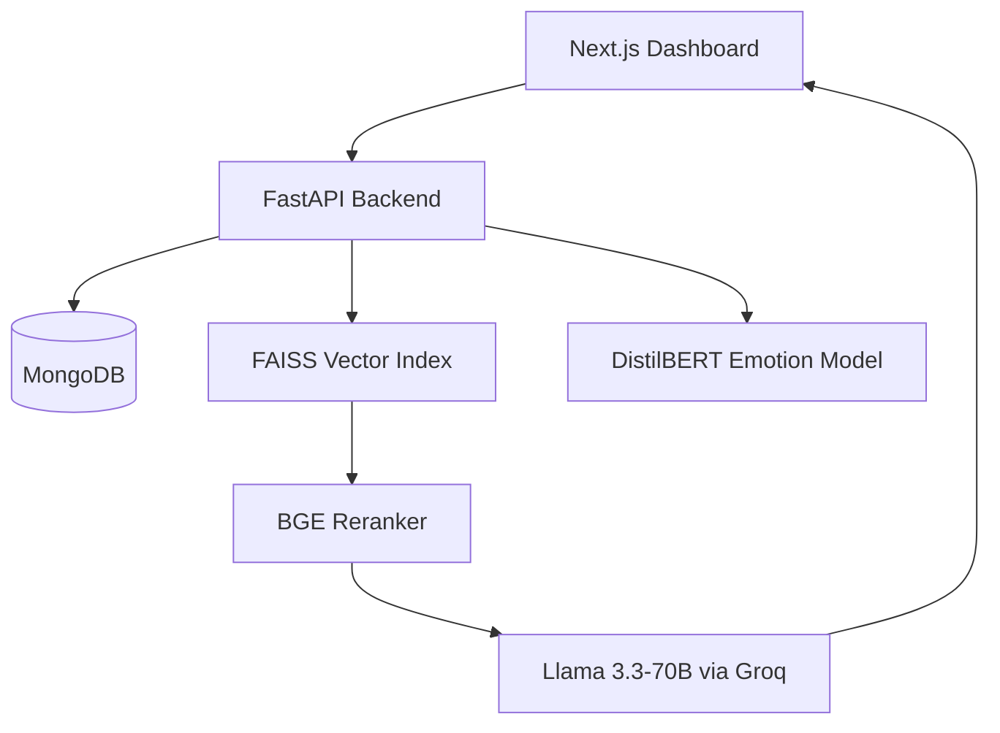

## Project Title
**Meetric Intelligence Hub: Turn Hours Of Dialogue Into Minutes Of Clarity**

### 🎥 Project Demonstration
[](https://drive.google.com/file/d/1HaxOBSXsASlW4IjiKtKmesqKk9N0GNvs/view?usp=drivesdk)


---

## The Problem
Meetings generate massive amounts of unstructured dialogue. Critical decisions and follow-up tasks are frequently lost in lengthy transcripts, while searching for specific insights across multiple historical sessions remains a manual and inaccurate process. This leads to information silos and decreased organizational accountability.

---

## The Solution
**Meetric Intelligence Hub** is a technical solution for converting dialogue into structured insights. By treating every transcript segment as a discrete data point, the system enables precise retrieval and automated intelligence extraction.

### **Core Philosophy / Approach: Grounded Retrieval**
The system is designed for **Traceability**. Unlike standard large language model (LLM) interfaces that may hallucinate summaries, Meetric ensures that every answer is grounded in specific transcript segments. Users can verify any AI claim by clicking a citation that deep-links directly to the source text.

### **🚀 Automated Intelligence Extraction**
- **Decision Capture**: Identifies strategic agreements via **Llama-3.3-70B** JSON-formatted extraction focused on consensus nodes.
- **Action Tracker**: Maps tasks to owners and deadlines using LLM-extracted structured objects with **MongoDB** persistence.
- **Formatted Export**: Dynamic report generation across **CSV and PDF** formats based on real-time extraction data.

### **📊 Speaker Intelligence & Analytics**
- **Behavioral Radar**: Aggregates speaker behaviors using **DistilBERT**-based emotion classification across dialogue segments.
- **Synchronized Timeline**: Plotted with **Recharts** to visualize chronological emotional shifts, linked directly to transcript nodes.
- **Speaker Profiling**: Normalized behavioral aggregation across multiple meetings to identify communication trends over time.
- **Sentiment Insights**: Rule-based one-line summary generation based on dominant emotion spikes throughout the session.

### **🧠 Advanced RAG Chatbot & UI Widget**
- **Scoped Search**: Metadata filtering (meeting-id) on the **FAISS index** to restrict retrieval results to a single transcript.
- **Global Search**: **Diversity-Aware Sampling** algorithm used to gather evidence from multiple meetings in the workspace.
- **Persistent Access**: A dedicated **Glassmorphic React Component** widget used for context-aware Q&A across the platform.
- **Evidence Documentation**: Source mapping using segment-id deep-links for **100% provenance verification**.

### **⚙️ Workspace Management**
- **Dynamic Grouping**: JavaScript-based grouping (Date/Project) on the frontend for organized archive navigation.
- **Multi-Format Ingestion**: Custom parsers for **WebVTT (.vtt)** and plain text (.txt) file structures.
- **Task Lifecycle**: **React Query** mutation logic used to sync task completion status between the UI and database.
- **Global Reset**: CRUD operations in MongoDB combined with **FAISS index resets** for environment cleanup.

### **🛡️ Contextual Validation**
- **Deep-Linking**: Index-based transcript navigation logic providing (±2) surrounding context segments.
- **Visual Pulse**: CSS-animated "pulse" triggered by citation navigation to guide the user's eye to target evidence.

---

## Tech Stack

Listing the core technologies used to build the Meetric Intelligence Hub:

- **Programming Languages**
  - **Python 3.10+**: Core backend logic, extraction services, and AI orchestration.
  - **TypeScript / JavaScript**: Multi-threaded frontend state management and visualization.

- **Frameworks**
  - **FastAPI**: Asynchronous Python API framework for high-concurrency request handling.
  - **Next.js 14.2 (App Router)**: Modern React framework for the dashboard interface.
  - **Tailwind CSS**: Utility-first styling for the analytical interface.
  - **TanStack Query (v5)**: Real-time server-state synchronization.

- **Databases**
  - **MongoDB**: Persistent document store for transcript metadata and intelligence objects.
  - **FAISS (Local CPU)**: Vector engine utilizing IVF-Flat indexing for millisecond-scale retrieval.

- **APIs or Third-Party Tools**
  - **Groq API (Llama 3.3-70B)**: High-speed inference for RAG and extraction.
  - **BGE-Reranker**: Cross-Encoder model for second-stage ranking precision.
  - **DistilBERT Emotion**: Pre-trained transformer for behavioral mapping.
  - **Hugging Face Transformers**: Library for local embedding and emotion model local execution.

### **Development & Deployment**
- **Environment**: Dotenv-based configuration for secure key management (`MONGO_URI`, `GROQ_API_KEY`).
- **Data Integrity**: **Pydantic v2** for strict request/response validation and schema enforcement.

---

## Setup Instructions

Provide the step-by-step commands to install dependencies and run the project locally.

### **1. Install Dependencies**

**Backend Installation:**
```bash
cd backend
python -m venv venv
source venv/bin/activate  # Windows: .\venv\Scripts\activate
pip install -r requirements.txt
```

**Frontend Installation:**
```bash
cd frontend/frontend
npm install
```

### **2. Setup Environment**

Configure your `.env` file in the `backend/` directory:
```env
MONGO_URI=your_mongodb_connection_string
GROQ_API_KEY=your_groq_api_key
```

### **3. Run the Project Locally**

**Start Backend Server:**
```bash
# In backend directory
uvicorn app.main:app --reload
```

**Start Frontend Application:**
```bash
# In frontend/frontend directory
npm run dev
```

---
## 4. System Architecture

Meetric is architected for **Low Latency** and **Data Privacy**.



### **Component Walkthrough**
1. **Ingestion Service**: Parses incoming transcripts, performs segmentation, and runs behavioral analysis via the Emotion Model.
2. **Persistence Layer**: Stores raw segments and metadata in MongoDB, while indexing vectors in **FAISS** for millisecond-scale retrieval.
3. **Inference Pipeline**: Orchestrates the reranking and generation logic using high-speed LLM infrastructure.

---

## 5. Technical Implementation: The RAG Pipeline

A 7-step process ensures factual accuracy in every response:
1. **Query Scoping**: Detects if the user is targeting a specific meeting or the entire workspace.
2. **Candidate Retrieval**: FAISS retrieves the top 100 most similar segments using vector similarity.
3. **Cross-Encoder Reranking**: Re-scores these 100 segments using `BAAI/bge-reranker-base` to account for complex semantic relationships.
4. **Diversity Sampling**: Ensures evidence is gathered from multiple relevant meetings rather than just the most verbose one.
5. **Context Assembly**: The most relevant segments are formatted into a prompt with unique segment IDs.
6. **Strict Generation**: The LLM is instructed to answer only based on the provided context with mandatory citations.
7. **Metadata Mapping**: Citations are linked back to the original database records for frontend interaction.

---

## 6. Technical Rationale

- **FAISS vs. Cloud Vector DBs**: Local FAISS indexing was chosen to minimize network latency and ensure that workspace data remains within the local infrastructure.
- **Cross-Encoder vs. Bi-Encoder**: While Bi-Encoders are fast for initial search, Cross-Encoders provide superior accuracy by analyzing the query and target text together, which is critical for legal or project-critical dialogue.
- **FastAPI / Next.js**: The stack was chosen for its asynchronous capabilities (FastAPI) and superior state management (TanStack Query/Next.js) to provide a zero-latency user experience.

---

## 7. Design & Interaction
The interface follows a **Minimalist Analytical** design:
- **Glassmorphic Depth**: Layers of information are separated using subtle transparency and blur effects for visual hierarchy.
- **Synchronized State**: Filter selections (Speakers, Meetings, Dates) update all visualizations across the dashboard simultaneously without page reloads.
- **Editorial Legibility**: Typography is optimized for long-form reading, with clear distinctions between transcript text and analytical data.

---


## Design & Interaction
The interface follows a **Minimalist Analytical** design:
- **Glassmorphic Depth**: Layers of information are separated using subtle transparency and blur effects for visual hierarchy.
- **Synchronized State**: Filter selections (Speakers, Meetings, Dates) update all visualizations across the dashboard simultaneously without page reloads.
- **Editorial Legibility**: Typography is optimized for long-form reading, with clear distinctions between transcript text and analytical data.

---

## API Documentation
Listing all backend endpoints available for workspace orchestration and intelligence retrieval:

### **Ingestion & Data Lifecycle**
- `POST /upload`: Multipart-form upload for `.vtt` and `.txt` transcripts. Initiates automated extraction and behavioral analysis.
- `GET /meetings`: Retrieves the complete archive of meeting metadata and summary analytics.
- `DELETE /meetings/{id}`: Permanently removes a specific meeting, its segments, and its vector indices from the workspace.
- `DELETE /meetings`: A global "Clear All" action for environment reset.

### **Intelligence & Search**
- `GET /chat`: Scoped RAG Q&A with clickable citations and diversity-aware global retrieval.
- `GET /search`: Keyword-based analysis search across stored transcripts.
- `GET /semantic-search`: High-precision vector similarity search using FAISS retrieval.

### **Analytics & Insights**
- `GET /speaker-analytics`: Behavioral profiling distribution for per-speaker consensus mapping.
- `GET /sentiment-flow`: Chronological mapping of sentiment-tagged segments for UI timeline plotting.
- `GET /sentiment-insight`: Automated rule-based dominant behavior summary (e.g., "High Consensus").

### **Tasks & Action Items**
- `POST /update-task`: Synchronizes the completion status of AI-extracted action items between the AI and Database.
- `GET /download`: Export capability for Decisions and Action Items in **CSV or PDF** formats.

---

## App Structure
```text
backend/
  routes/       # API endpoints (Upload, Chat, Analytics, Tasks)
  services/     # AI Pipeline logic (RAG, Extraction, Emotion)
  db/           # Shared database collections
frontend/
  src/
    components/   # Dashboard widgets (Radar, Timelines, Chat)
    pages/        # Feature views (Actions, Decisions, Semantics)
    lib/          # API client and utility logic
```

---

## Demo Flow
1. **Ingestion**: Drop a `.vtt` file to initiate the "Hot-Extract" pipeline.
2. **Behavior Analysis**: View the **Collaborator Radar** to assess team dynamics.
3. **Timeline Inspection**: Use the **Dialogue Inspector** to drill down into specific sentiment nodes.
4. **Global Query**: Use the persistent **AI Widget** to ask cross-meeting questions.
5. **Report Generation**: Export the action items and decision items as a finalized CSV document.

---

## Future Roadmap: Scaling to Production

- **Cloud Vector Orchestration**: Migrating to managed Vector DBs (Pinecone/Weaviate) and asynchronous task queues for enterprise-scale ingestion.
- **Multi-Modal Diarization**: Native audio/video processing with high-accuracy speaker labeling via Whisper v3.
- **Enterprise Integrations**: Two-way synchronization with **Jira, Slack, and Linear** for automated task and intelligence distribution.
- **Relational Intelligence**: Transitioning to a **Graph RAG (Neo4j)** architecture to map complex relationships across months of organizational dialogue.
