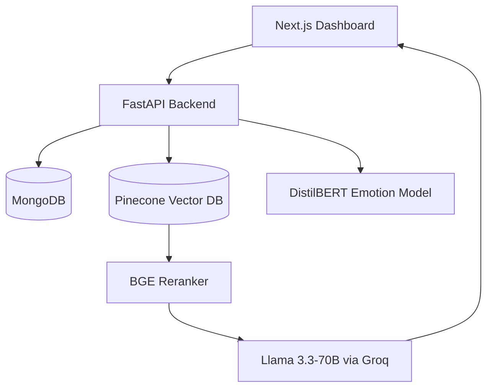

# Meetric Intelligence Hub

> Meetric Intelligence Hub: Turn Hours Of Dialogue Into Minutes Of Clarity

---

## 🎥 Project Demonstration
[](https://drive.google.com/file/d/1HaxOBSXsASlW4IjiKtKmesqKk9N0GNvs/view?usp=drivesdk)

---

## Project Objective
**Meetric Intelligence Hub: Turn Hours Of Dialogue Into Minutes Of Clarity**

---

## The Problem
Meetings generate massive amounts of unstructured dialogue. Critical decisions and follow-up tasks are frequently lost in lengthy transcripts, while searching for specific insights across multiple historical sessions remains a manual and inaccurate process. This leads to information silos and decreased organizational accountability.

---

## The Solution
**Meetric Intelligence Hub** is a technical solution for converting dialogue into structured insights. By treating every transcript segment as a discrete data point, the system enables precise retrieval and automated intelligence extraction.

### Core Philosophy / Approach: Grounded Retrieval
The system is architected for traceability. Unlike standard LLM interfaces that may hallucinate summaries, Meetric ensures every answer is grounded in specific transcript segments. Users can verify any AI claim via citations that deep-link directly to the source text within the original transcript.

### Automated Intelligence Extraction
- **Decision Capture**: Identifies strategic agreements via Llama-3.3-70B JSON-formatted extraction focused on consensus nodes.
- **Action Tracker**: Maps tasks to owners and deadlines using LLM-extracted structured objects with MongoDB persistence.
- **Formatted Export**: Dynamic report generation across CSV and PDF formats based on real-time extraction data.

### Speaker Intelligence & Analytics
- **Behavioral Radar**: Aggregates speaker behaviors using DistilBERT-based emotion classification across dialogue segments.
- **Synchronized Timeline**: Plotted with Recharts to visualize chronological emotional shifts, linked directly to transcript nodes.
- **Speaker Profiling**: Normalized behavioral aggregation across multiple meetings to identify communication trends over time.

### RAG Query Engine
- **Managed Vector Search**: Metadata-based filtering on the Pinecone index to enable precise scoped queries or global workspace searches.
- **Global Retrieval**: Diversity-aware sampling algorithm gathers evidence from multiple meetings regardless of transcript length.
- **Persistent Access**: A dedicated glassmorphic React component for context-aware Q&A across the platform.
- **Evidence Documentation**: Source mapping using segment-id deep-links for 100% provenance verification.

---

## System Architecture

Meetric is architected for low latency, persistence, and data reliability. The system follows a decoupled architecture where metadata is stored in a document database (MongoDB) and semantic embeddings are managed in a high-performance vector store (Pinecone).



### Component Walkthrough
1. **Ingestion Service**: Parses raw transcripts (WebVTT/TXT), performs semantic segmentation, and executes behavioral analysis via local transformer models.
2. **Persistence Layer**: Synchronizes MongoDB (for document metadata) with Pinecone (for vector embeddings), ensuring unified data lifecycle management.
3. **Inference Pipeline**: Orchestrates multi-stage retrieval, cross-encoder reranking, and Groq-hosted LLM generation for low-latency RAG responses.

---

## Technical Rationale & Tradeoffs

### Two-Stage Retrieval (Recall vs. Precision)
The system separates retrieval into two distinct phases using a **Bi-Encoder + Cross-Encoder** architecture.
- **Rationale**: Standard vector search (Bi-Encoder) is effective for finding relevant candidates quickly but often fails on nuanced semantic boundaries. We use Pinecone for high-recall candidate selection, followed by a BGE Cross-Encoder for high-precision reranking.
- **Tradeoff**: This approach adds ~200-400ms of latency per query compared to single-stage retrieval, but significantly reduces hallucination by ensuring the LLM only sees the most semantically relevant context.

### Decoupled Metadata & Vector Storage
Meetric utilizes MongoDB for structured persistence and Pinecone for semantic search.
- **Rationale**: Document databases are superior for managing complex meeting metadata (speaker profiles, analysis results, structured decisions), while specialized vector databases offer superior scaling and native metadata filtering features.
- **Tradeoff**: Requires manual synchronization logic. Deleting a meeting requires two API calls (DB + Pinecone). We mitigate this with a synchronized deletion service that ensures no "ghost data" remains if one store fails.

### LLM Inference via Groq
Generative responses and structured extraction are powered by **Llama 3.3-70B** hosted on Groq's LPU infrastructure.
- **Rationale**: Real-time analytical tools require sub-second generation to remain usable. Groq provides the throughput necessary for processing long contexts without the latency bottlenecks of traditional cloud providers.
- **Tradeoff**: Dependency on a third-party API. In a production environment, this would be backed by a fallback local inference engine or alternative cloud provider.

---

## Demo Flow

1. **Ingestion**: Upload a `.vtt` or `.txt` transcript in the **Upload** view. The system performs real-time segmentation and behavioral tagging.
2. **Analysis Overview**: Navigate to the **Meeting Archive**. View automated summaries, speaker dynamics, and emotional spikes across your meeting history.
3. **Intelligence Extraction**: Access the **Decisions** and **Actions** views to see structured nodes extracted by the AI pipeline.
4. **Semantic Querying**: Use the **Query Engine** (Global Search) to ask questions across your entire workspace or a specific meeting. 
5. **Evidence Verification**: From a chat response, click **Show Evidence** to see the exact transcript segments used for grounding. Clicking a segment deep-links directly to its position in the transcript view.
6. **Reporting**: Use the **Export** feature to download aggregated intelligence as a CSV or PDF document.

---

## Technical Implementation: The RAG Pipeline

A two-stage process ensures high-precision retrieval and factual groundedness:

### Stage 1: Retrieval (Recall)
- **Vector Search**: Pinecone retrieves the most semantically similar segments using dense vector similarity.
- **Metadata Filtering**: Precise scoping using `meeting_id` to filter results for specific meetings or global searches.

### Stage 2: Reranking (Precision)
- **Cross-Encoder Reranking**: Re-scores candidates using `BAAI/bge-reranker-base` to capture deep semantic nuances between the query and context.
- **Diversity Sampling**: Ensures evidence is balanced across multiple relevant meetings to prevent bias toward verbose transcripts.
- **Sigmoid Normalization**: Maps raw reranker logits to a 0–1 probabilistic range for accurate UI confidence scoring.

---

## System Improvements

Recent architectural updates have focused on system reliability and data precision:

- **Persistent Vector Storage**: Migration to Pinecone ensures embeddings are preserved across server restarts without requiring re-indexing.
- **Accurate Deletion**: Synchronized deletion logic ensures that removing a meeting from MongoDB also purges its corresponding vectors from Pinecone, preventing "ghost results."
- **Deterministic Vector IDs**: One-to-one mapping between transcript segments and vector IDs ensures idempotency and simplifies retrieval logic.
- **Deduplication**: Duplicate transcript segments are filtered during ingestion to prevent redundant vectors and noise in retrieval results.
- **Metadata Filtering**: Native Pinecone filtering enables millisecond-scale scoped searches using meeting identifiers.
- **Improved Confidence Scoring**: Confidence levels are normalized using a stable sigmoid function based on reranker outputs for consistent user feedback.

---

## Tech Stack

Listing the core technologies used to build the Meetric Intelligence Hub:

- **Programming Languages**
  - **Python 3.10+**: Core backend logic and AI orchestration.
  - **TypeScript / JavaScript**: Frontend state management and dashboard visualizations.

- **Frameworks & UI**
  - **FastAPI**: Asynchronous Python API framework.
  - **Next.js 14.2 (App Router)**: Modern React framework for the analytical interface.
  - **Tailwind CSS**: Utility-first styling.
  - **TanStack Query (v5)**: Server-state synchronization.

- **Databases & Storage**
  - **MongoDB**: Persistent document store for transcript metadata and intelligence objects.
  - **Pinecone (Serverless)**: Managed vector database for high-recall semantic retrieval and metadata filtering.

- **AI/ML Infrastructure**
  - **Groq (Llama 3.3-70B)**: High-speed LPUs for low-latency RAG orchestration and structured data extraction.
  - **Hugging Face Transformers**: Execution engine for local models (`all-MiniLM-L6-v2` for embeddings).
  - **BAAI BGE-Reranker**: Cross-Encoder model used for precision-stage ranking.
  - **DistilBERT**: specialized transformer for chronological behavioral mapping.

- **Development & Validation**
  - **Pydantic v2**: Strict schema enforcement for backend data models.
  - **TanStack Query (v5)**: Strategic caching and synchronization of server state.
  - **Radix UI / Lucide**: Accessible, high-precision component primitives.
  - **Framer Motion**: Choreographed micro-animations for dashboard state transitions.

---

## Future Roadmap

- **Multi-Modal Diarization**: Native processing of audio/video files with automated Whisper-based transcription and speaker labeling.
- **Relational Intelligence**: Transitioning from flat vector retrieval to **Graph RAG (Neo4j)** to map long-term organizational relationships and project dependencies.
- **Enterprise Integrations**: Bi-directional synchronization with project management tools (**Jira, GitHub, Linear**) for automated task distribution.
- **Proactive Intelligence**: Automated email briefings and Slack updates triggered by meeting consensus nodes or high-sentiment shifts.

---

## Setup Instructions

### 1. Install Dependencies

**Backend:**
```bash
cd backend
python -m venv venv
source venv/bin/activate  # Windows: .\venv\Scripts\activate
pip install -r requirements.txt
```

**Frontend:**
```bash
cd frontend/frontend
npm install
```

### 2. Pinecone Setup
Create a Pinecone index with the following configuration:
- **Dimension**: 384
- **Metric**: cosine
- **Vector type**: dense

### 3. Environment Configuration
Configure your `.env` file in the `backend/` directory:
```env
MONGO_URI=your_mongodb_connection_string
GROQ_API_KEY=your_groq_api_key
PINECONE_API_KEY=your_pinecone_api_key
PINECONE_INDEX_NAME=your_pinecone_index_name
```

### 4. Run Locally

**Start Backend Server:**
```bash
uvicorn app.main:app --reload
```

**Start Frontend Application:**
```bash
npm run dev
```

---

## API Documentation

- `POST /upload`: Transcript ingestion with automated extraction and behavioral analysis.
- `GET /meetings`: Archive of meeting metadata and summary analytics.
- `DELETE /meetings/{id}`: Synchronized removal of meeting data from MongoDB and Pinecone.
- `GET /chat`: Scoped or global RAG query endpoint with normalized confidence and citations.
- `GET /semantic-search`: High-precision vector similarity retrieval via Pinecone.
- `GET /speaker-analytics`: Behavioral profiling distribution for per-speaker mapping.
- `GET /sentiment-insight`: Automated rule-based dominant behavior summaries.
- `GET /download`: Export intelligence reports in CSV/PDF formats.

---

## App Structure
```text
backend/
  routes/       # API endpoints (Upload, Chat, Analytics)
  services/     # AI Pipeline (RAG, Extraction, Emotion, Pinecone)
  db/           # Database configuration
frontend/
  src/
    components/   # Analytical widgets (Timelines, Chat)
    pages/        # Dashboard views (Actions, Decisions)
```
